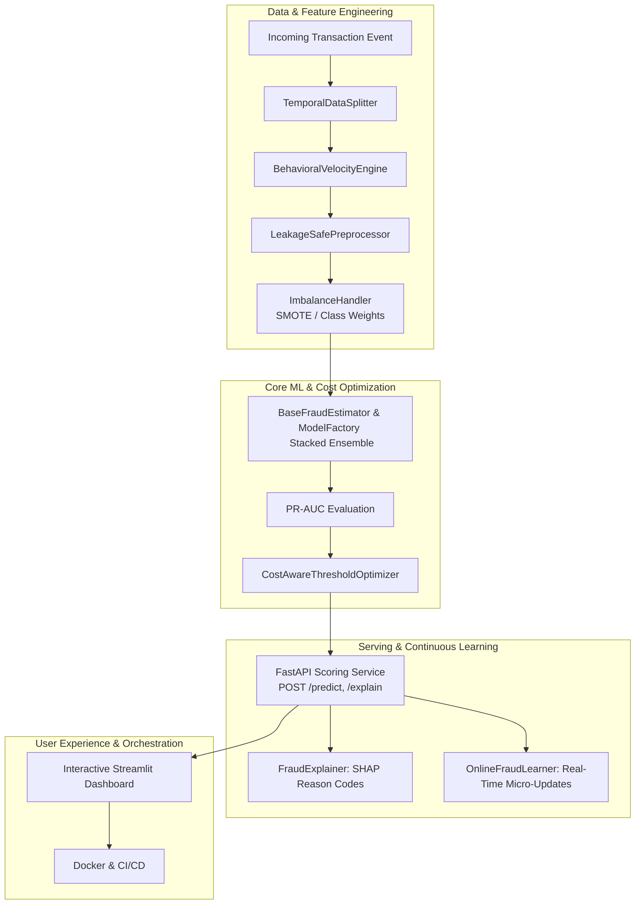

# 🛡️ Next-Gen Financial Fraud Detection & MLOps Platform

[](https://github.com/sathviknalla/credit-card-fraud-detection/actions)
[](https://www.python.org/downloads/)
[](https://fastapi.tiangolo.com/)
[](https://streamlit.io/)
[](https://opensource.org/licenses/MIT)

An enterprise-grade, production-ready machine learning platform for detecting credit card fraud. This system goes beyond basic modeling to provide a complete MLOps lifecycle, including cost-aware threshold optimization, local SHAP explainability, streaming concept drift detection, online micro-learning, and an interactive analyst dashboard.

## ✨ Key Capabilities

* **Leakage-Safe Feature Engineering**: Strict 70/15/15 chronological temporal splits, Cyclical time encodings, RobustScaling, and train-set-only SMOTE resampling to guarantee zero data leakage.
* **Level-2 Stacked Ensembles**: Combines XGBoost, Random Forest, and Logistic Regression with out-of-fold predictions and a meta-learner for robust PR-AUC performance.
* **Financial Cost-Aware Optimization**: Automatically tunes decision thresholds to minimize total expected financial loss (e.g., $120 False Negative, $5 False Positive) while strictly adhering to manual review workload constraints ($\le 1.5\%$).
* **Local Explainability**: Real-time TreeSHAP attributions mapped to human-readable risk reason codes for analyst investigations.
* **Continuous Online Learning**: A `partial_fit` incremental learning pipeline that seamlessly ingests newly confirmed chargebacks to adapt to emerging fraud vectors.
* **Concept Drift Monitoring**: Streaming Population Stability Index (PSI) and Kolmogorov-Smirnov tests to monitor feature distribution shifts.
* **Microservices Architecture**: A blazing-fast FastAPI scoring service combined with a rich Streamlit Operations Dashboard.

---

## 🏗️ System Architecture



---

## 🚀 Getting Started

### 1. Run via Docker Compose (Recommended)
The easiest way to spin up both the FastAPI backend and Streamlit dashboard is using Docker:
```bash
docker-compose up --build
```
* **Dashboard**: `http://localhost:8501`
* **API Docs**: `http://localhost:8000/docs`

### 2. Local Python Development Setup
Clone the repository and install the requirements:
```bash
python -m venv venv
venv\Scripts\activate      # Windows
# source venv/bin/activate # Linux/Mac

pip install -r requirements.txt
```

**Run the Automated Test Suite:**
```bash
python -m pytest -v
```

**Train the Pipeline (Generates artifacts in `/artifacts`):**
```bash
python train.py --model ensemble
```

**Start the FastAPI Server:**
```bash
python -m uvicorn fastapi_app:app --host 0.0.0.0 --port 8000 --reload
```

**Start the Analyst Dashboard:**
```bash
python -m streamlit run dashboard.py
```

---

## 📡 API Reference

The FastAPI service exposes several endpoints for production integration.

| Endpoint | Method | Description |
| :--- | :--- | :--- |
| `/predict` | `POST` | Scores a transaction, returning probability, a routing decision (`APPROVE`, `MANUAL_REVIEW`, `DECLINE`), and top SHAP reasons. |
| `/explain` | `POST` | Returns a deep dive SHAP decomposition of every feature. |
| `/feedback` | `POST` | Ingests confirmed labels to trigger the incremental Online Learner. |
| `/drift` | `GET` | Returns PSI and KS-Test statistics for system distribution shifts. |
| `/health` | `GET` | Returns model loading status and current optimal threshold. |

---

## 📁 Repository Structure
* `train.py` - Core execution script for the end-to-end ML pipeline.
* `fastapi_app.py` - REST API backend implementation.
* `dashboard.py` - Streamlit Operations Console UI.
* `ensemble_pipeline.py` / `model_pipeline.py` - Core Estimators and Meta-Learners.
* `cost_evaluation.py` - Financial impact minimization constraint solver.
* `explainability.py` - SHAP TreeExplainer integration.
* `drift_monitoring.py` - Streaming PSI metric evaluation.
* `retraining_scheduler.py` - Champion-Challenger model registry.

---
*Built with ❤️ for advanced machine learning operations.*
